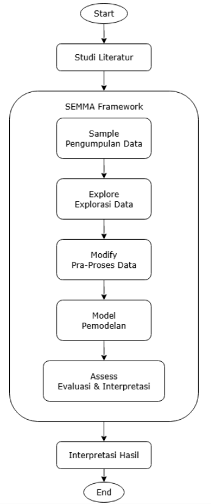

# Jakarta Public Transport Sentiment Analysis
### Hybrid AI Approach: Lexicon-Based + Naive Bayes Classifier


## Executive Summary
This project analyzes public opinion regarding Jakarta's public transport system (TransJakarta, KRL, MRT) using Twitter data. The goal was to uncover dominant passenger complaints often missed by conventional surveys.

Using a Hybrid Approach (Lexicon-based + Naive Bayes), I developed a machine learning model that achieved 92.57% accuracy. The study revealed that while most conversations are informational (Neutral), negative feedback is heavily concentrated on punctuality and facility maintenance.

📄 **[Read the Full Research Report (PDF)](Research_Report.pdf)**

---

## Methodology: SEMMA Framework
The analysis follows the **SEMMA** (Sample, Explore, Modify, Model, Assess) data mining framework to ensure structured results.



*(Figure: Research workflow implementing SEMMA methodology)*

1.  **Sample:** Collected 1,001 tweets (March-May 2025) using *Tweet Harvest*.
2.  **Explore:** Identified that 87.7% of data is dominated by Neutral sentiment.
3.  **Modify:** Applied Text Preprocessing (Regex cleaning) and Data Balancing (Random Under-Sampling).
4.  **Model:** Trained a Multinomial Naive Bayes classifier with TF-IDF feature extraction.
5.  **Assess:** Evaluated model performance using Confusion Matrix and F1-Score.

---

## Technical Implementation

### A. Preprocessing Pipeline
Cleaning social media data is critical due to noise (slang, links, mentions). I implemented a Regex-based cleaning function as documented in the report.
*([`Scrape_Transportasi_Umum.ipynb`](Scrape_Transportasi_Umum.ipynb))*

```python
import re

def clean_text(text):
    # Remove URLs
    text = re.sub(r"http\S+|www\S+|https\S+", "", text, flags=re.MULTILINE)
    # Remove Mentions (@username)
    text = re.sub(r"@\w+", "", text) 
    # Remove Hashtags
    text = re.sub(r"#\w+", "", text) 
    # Remove Symbols & Numbers (Keep letters only)
    text = re.sub(r"[^a-zA-Z\s]", "", text) 
    return text
```
### B. Hybrid Modeling Logic
To overcome the limitations of a single model, I combined two methods:
* **Lexicon Based:** Used for *auto-labeling* the training dataset using a domain-specific dictionary (keywords: *macet*, *telat*, *nyaman*).
* **Naive Bayes:** Used as the final classifier to predict sentiment probability on unseen data.

```python
from sklearn.feature_extraction.text import TfidfVectorizer
from sklearn.naive_bayes import MultinomialNB

# 1. Feature Extraction (TF-IDF)
# Extracting top 1,000 features to reduce noise
vectorizer = TfidfVectorizer(max_features=1000)
X = vectorizer.fit_transform(df['full_text'])

# 2. Model Training
model = MultinomialNB()
model.fit(X_train, y_train)
```
## Key Findings & Results

### 1. Sentiment Distribution
The analysis reveals a massive dominance of Neutral sentiment (87.72%), indicating that Twitter is primarily used for information sharing (e.g., schedules, routes) rather than direct complaints.


### 2. Model Performance
After applying Random Under-Sampling to balance the dataset, the Hybrid model demonstrated superior performance compared to the baseline.
* **Accuracy:** **92.57%**
* **Key Insight:** Although negative tweets were the minority (5.31%), they highlighted specific critical issues:
  Keterlambatan (Delays) dan Fasilitas Rusak (Broken Facilities like AC or Seats)


*(Figure: Confusion Matrix showing balanced prediction capabilities)*
